## Response 1: Context, Visualization, and the Risks of Interpretive Inflation 

For this response, I returned to the visualizations I generated for Assignment 1 including a word cloud, a line graph comparing thematic frequencies, and a bar chart contrasting total “agency” and “institution” counts across five Harry Potter texts (canonical novels and fan fiction). I tested how two LLMs, Perplexity AI and Ministerial AI, interpreted these visuals. I first gave them the images with no context, then gradually introduced contextual information. The prompts included were explain what you see in this visualization. What conclusions can be drawn from this visualization? What assumptions are you making? Here is the context: these texts are canonical Harry Potter novels and fan fiction. How does that change your interpretation? What emerged was not simply an explanation of patterns, but a revealing demonstration of how context shapes and amplifies interpretation. 
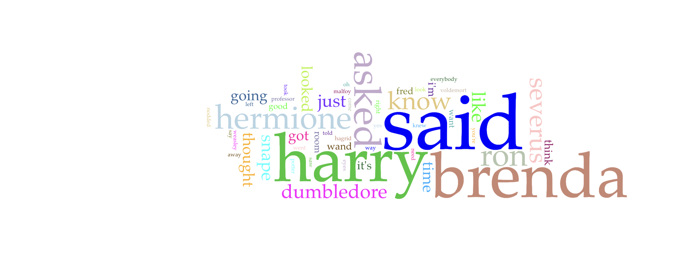

*Figure 1. Word cloud showing the most frequent words in the Harry Potter corpus. Larger words appear more frequently in the texts.*

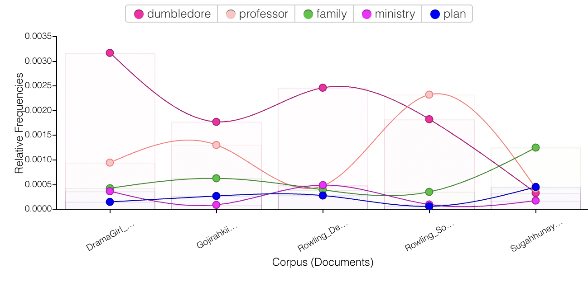

*Figure 2. Relative frequency of themes such as “Dumbledore,” “professor,” “family,” “ministry,” and “plan” across different Harry Potter fan fiction corpora.*

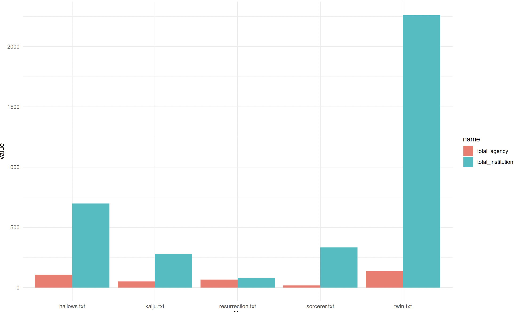

*Figure 3. Bar chart comparing the frequency of “agency” and “institution” across several Harry Potter texts.*

Both models correctly identified the word cloud in the absence of context: conversation verbs like "said" signal narrative density; character names like "Harry," "Hermione," and "Dumbledore" dominate; and larger words indicate higher frequency. Interpretation was cautious and mostly descriptive at this point. However, both models drastically changed when I included the context that these texts contain fan fiction and canonical Harry Potter novels. Perplexity started recognizing certain books and proposing fan fiction clichés like character backstories and other dimensions. Ministerial AI, while more structured and methodical, also connected frequency patterns to world-building and institutional themes in the wizarding universe.
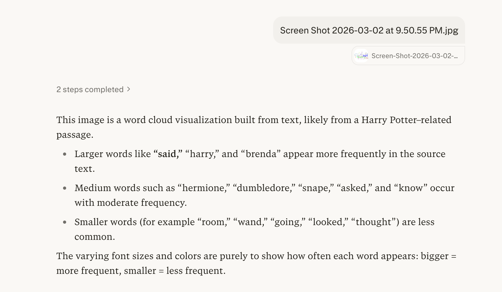

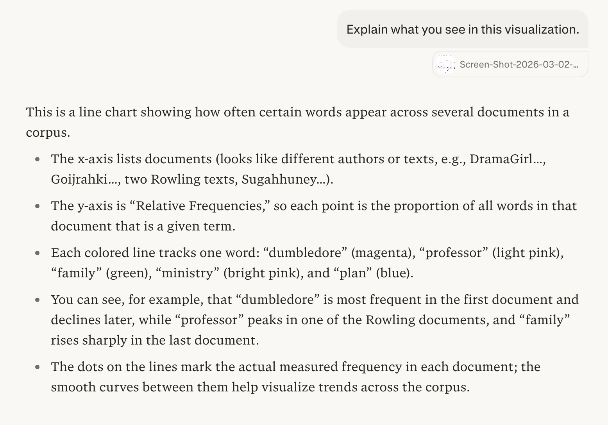

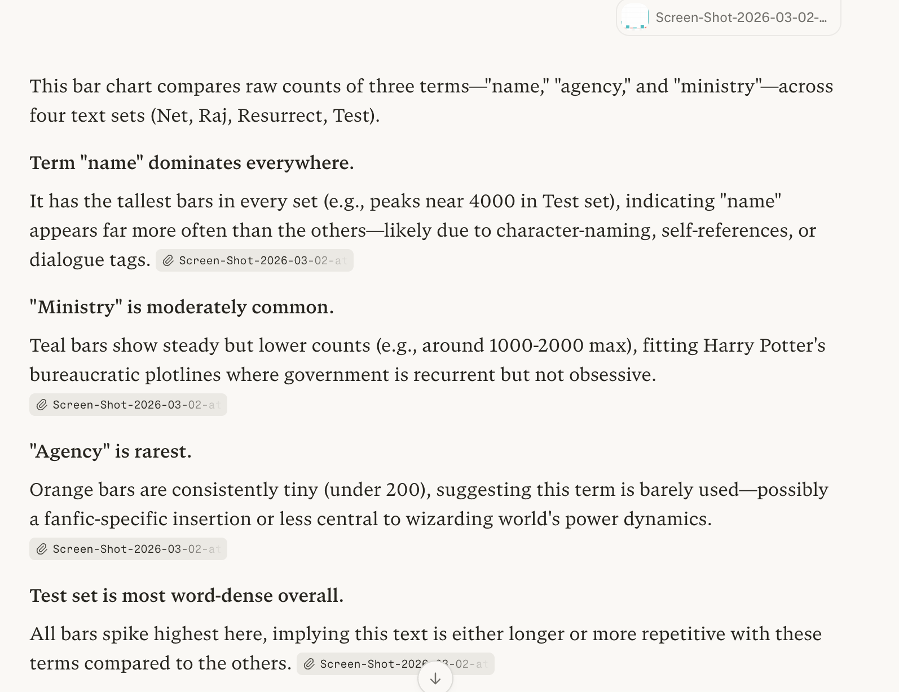
*Figure 4. Perplexity AI explaining the word cloud, line graph, and bar chart visualizations when prompted without context.*

There are no narrative arcs, thematic subtleties, or book-specific metadata in the word cloud itself. However, both LLMs eventually converted statistical recognition into literary significance. Character names served as confirmation of the narrative's emphasis, while large words served as evidence of "central themes." This illustrates a fundamental foundation: significance is equivalent to frequency. Computational tools find patterns, but contextual framing is necessary for interpretation, as Underwood explains in The Risks of Distant Reading. The LLMs unconsciously made an interpretative jump in our experiment, frequently going beyond what the image itself properly allows.

A similar result was obtained from the line graph that compared topic frequencies among corpora. The models described peaks and relative differences in the absence of context. With context, they started making assumptions about reader preferences, fan community tendencies, and authorial purpose. Ministerial AI listed methodological presumptions such theme labeling accuracy and corpus size consistency, framing its interpretation more cautiously. In contrast, perplexity swiftly transitioned into narrative guesswork, proposing that certain fan writers "personalize" or "diversify" canonical themes.

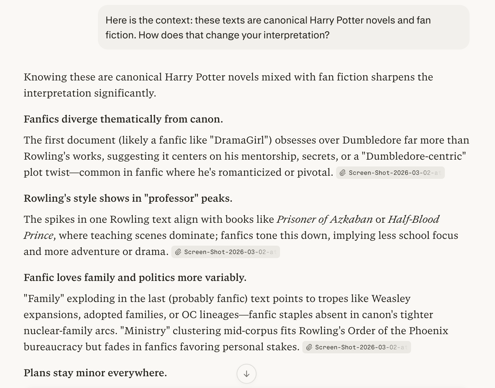
*Figure 5. Perplexity AI generating conclusions about the thematic frequency line graph.*

The bar graph that compared the overall "agency" and "institution" numbers was the most striking. The graphic just demonstrated that, across texts, institutional phrases were more common than agency-related terms. However, both models included philosophical claims: that characters function within structural limitations, that the Harry Potter universe favors systemic power over individual autonomy, and that fan fiction broadens institutional study. Although such claims are acceptable, the chart does not explicitly convey them. 
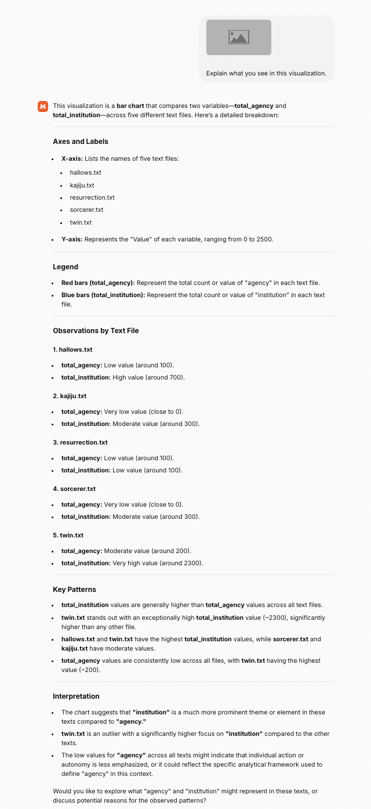

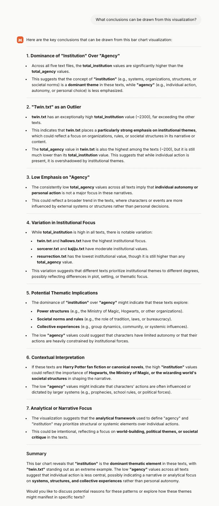

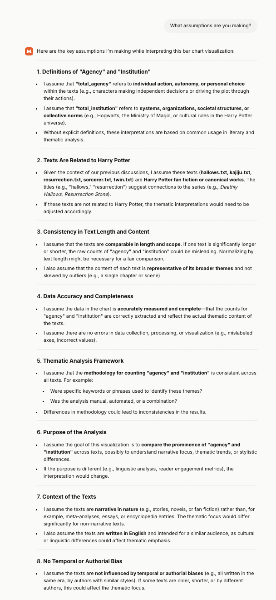

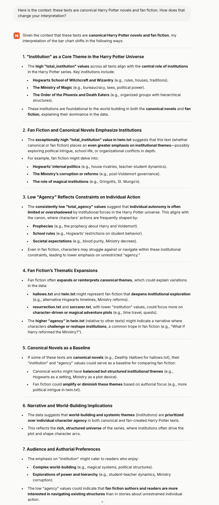
*Figure 6. Ministerial AI interpreting the agency versus institution bar chart.*

This is what I would refer to as interpretative exaggeration. Numerical data acquires rhetorical force once it is displayed. Both human and machine viewers are encouraged to consider patterns as arguments by the visual structure. Without considering how those terms were operationalized, the models assumed that "agency" and "institution" were directly related to autonomy and power structures, respectively. Additionally, they made the assumption that text lengths would be similar and that counting techniques would be uniform. These presumptions influenced the outcomes even though they were occasionally stated clearly (particularly by Ministerial AI).

The fact that context promotes interpretative daring is another important finding from this experiment. Both LLMs remained descriptive in the absence of context. Their interpretations became more certain and genre-aware after learning that the corpus contained both canonical works and fan writing. In example, Perplexity started making references to particular canonical arcs and fan fiction tropes that were not evident in the data. This implies that after basic inputs are presented, LLMs engage probability genre knowledge rather than just analyzing pictures.
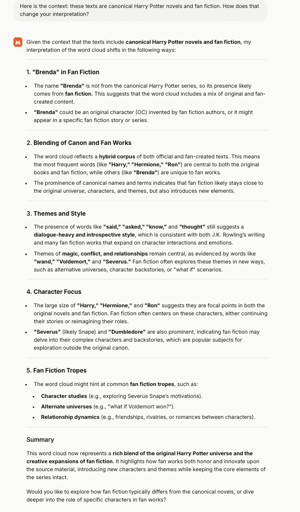

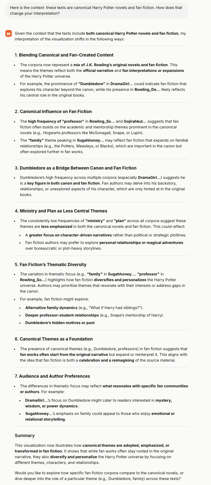

*Figure 7. Prompt introducing contextual information to Ministerial AI about canonical Harry Potter novels and fan fiction.*

Furthermore, my personal perspective was also impacted by this experiment. The models' theme statements seemed intuitively obvious, so at first I found myself agreeing with them. I didn't understand how many inferential steps separated narrative conclusions from raw counts until I gave it some thought. This is consistent with Hermeneutica's explanations of how computers quantify words but not meaning. Although quantification gives the impression of objectivity, interpretation is still a human (or model-driven) process superimposed on statistical structure.

Do images speak for themselves? According to this experiment, they don't. They demand methodological disclosure, definitional clearness, and contextual structuring. Visualizations are easily overread in the absence of explanation, particularly when they are processed by algorithms that have been trained to narratively complete patterns. The LLMs showed how easily remote reading may turn into speculative narrative, even though they weren't "incorrect."

In conclusion, this process has made me more cautious about visualization-based interpretation. Computational tools are powerful for surfacing patterns, but patterns are not arguments. As Underwood reminds us, distant reading identifies regularities; it does not eliminate the need for critical judgment. My experiment shows that LLMs can assist interpretation, but they can also amplify assumptions. Context does not simply clarify meaning  it shapes and sometimes exaggerates it.

READY FOR GRADING 